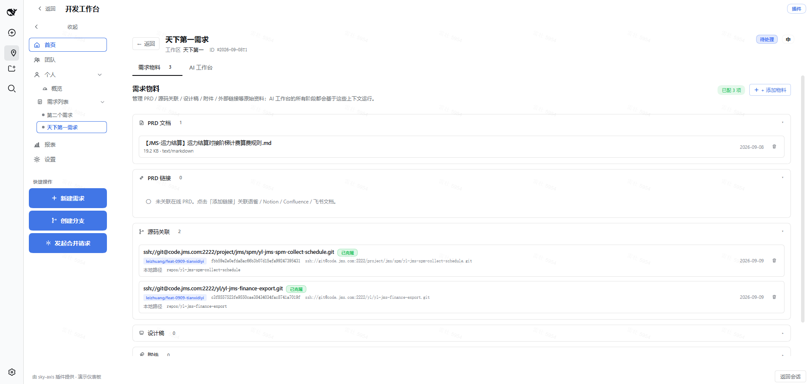
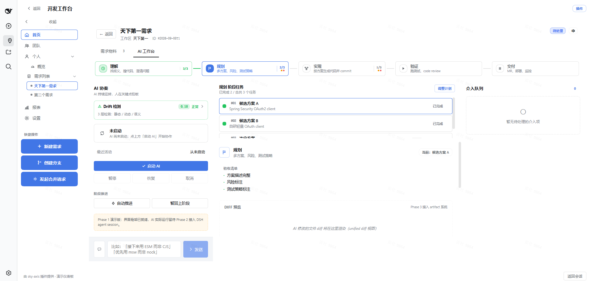
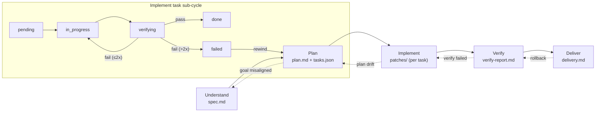
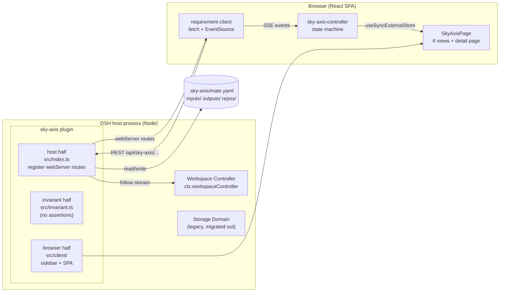

# @leizhuang/sky-axis

中文 | [中文](README.zh.md)

A browser-only DSH web GUI plugin that renders a developer workspace
("sky-axis") in the main column: a sidebar with a collapsible icon rail, a
two-level personal menu (Personal → Requirements), 5 top-level views
(Home / Team / Personal / Requirements / Reports / Settings), and a full
Requirement CRUD + SSE sync against the host half. It mounts into the
official sidebar entry seat — no DSH source changes, nothing runs on the
host's UI side beyond the routes it registers.

---




**AI workbench — 5-stage pipeline with task sub-cycle and rewind**



---

## Introduction

**sky-axis** is a developer workbench plugin for DSH (DeepSeek Harness) that
brings structured requirement management and AI-driven development workflows
into your IDE — so a requirement is no longer a chat message, but a tracked,
material-rich, AI-executable unit of work.

### The Problem

Modern AI coding assistants operate on a single, ephemeral conversation. There
is no structured place to capture *what* we are building and *why*, no pipeline
that drives AI from understanding to delivery, and no mechanism to detect or
correct when the AI drifts off course. Development materials — PRDs, design
docs, source repos, attachments — scatter across tools, and teams lack a single
source of truth for requirement-driven development.

### The Solution

sky-axis mounts a full-page **"Developer Workbench"** (开发工作台) inside DSH —
**zero source changes**. It introduces a **5-stage AI pipeline**
(Understand → Plan → Implement → Verify → Deliver) where each stage produces
typed artifacts, decomposes into tasks, and supports drift detection plus
human intervention. Requirements are bound 1:1 to DSH workspaces and persisted
as YAML (`.sky-axis/mate.yaml`) with file locking for safe concurrent access.

### What You Get

- **Structured requirements** — create, group by workspace, and track the full
  lifecycle with real-time SSE sync across tabs.
- **AI workbench** — a 5-stage stepper with task lists, drift detection, and
  rewind / rollback so AI never runs unchecked.
- **Materials hub** — PRD files & links, source repos, design links,
  attachments, and external links gathered in one place.
- **Human-in-the-loop** — 5 intervention points (task start, mid-execution
  steer, task acceptance, failure resolution, stage gate) keep you in control.
- **Zero-integration** — a pure browser plugin that plugs into DSH's sidebar
  without modifying any DSH source.

### Key Features

- Sidebar entry (36px icon) with collapsible icon rail + two-level personal
  menu (Personal → Overview / Requirements).
- 6 views: Home / Team / Personal / Requirements / Reports / Settings.
- Requirement CRUD with workspace grouping and SSE real-time sync.
- Requirement detail page with **Materials** and **AI Workbench** tabs.
- 5-stage AI pipeline (Understand → Plan → Implement → Verify → Deliver) with
  a three-column layout: AI Conductor / Stage Workspace / Intervention Queue.
- Task decomposition with 8-state task status and drift detection.
- 6 material sections (PRD files, PRD links, source repos, design links,
  attachments, external links).
- YAML-as-SoT persistence with atomic file locking.
- Chinese / English i18n via the official `ctx.locale` service.

### Architecture Diagrams

**Overall architecture — three halves inside one DSH plugin**



---

## What it does

- Adds a 36px circular icon trigger in the sidebar tree (alongside Chat,
  Skills, etc.) labeled `SkyAxis`. Clicking it opens / closes the
  sky-axis page in the main column.
- Inside the page:
  - Sidebar (208px / 48px collapsed) with 5 entries + a "Personal" group
    entry that toggles a submenu (Requirements).
    - Home: metric cards + activity stream + team overview.
    - Team: progress / MRs / members (mock).
    - Personal: profile + stats (mock).
    - Requirements: grouped by workspace, full CRUD via host REST + SSE.
    - Reports: SVG charts (mock).
    - Settings: theme / language toggles (mock).
  - Quick Actions footer (New Requirement / Create Branch / Open MR).
- Locale-aware: registers `zh` / `en` dictionaries through the official
  `ctx.locale` service.
- Host half: registers `/api/sky-axis/...` webServer routes
  (`ping` / `health` / `requirements` CRUD / SSE / `workspaces`).

## Install

### From the repository (development)

```sh
dsh plugin --profile web add link:/Users/Ray/TraeProjects/sky-axis
```

Restart `dsh web` (or wait for the hot-reload) and look for the SkyAxis
entry in the sidebar.

### From npm (once published)

```sh
dsh plugin --profile web add @leizhuang/sky-axis@latest
```

## Build

```sh
pnpm install
pnpm run build         # tsc -p tsconfig.build.json && tsdown
pnpm run watch         # tsdown --watch (rebuild on file change)
pnpm run typecheck     # tsc --noEmit
pnpm run test          # vitest run
```

Outputs land under `lib/`:

- `lib/index.js` — host entry (registers webServer routes)
- `lib/invariant.js` — invariant companion (no assertions)
- `lib/client.js` — browser bundle, wrapped in a `window.__ModuleLoader__.load`
  closure as required by the loader module table
- `lib/types/` — TypeScript declarations

## Architecture

```
src/
├── index.ts                         # Host apply: register routes (webServer)
├── invariant.ts                     # Invariant companion (no assertions)
├── protocol.ts                      # Cross-half shared contract (endpoints + zod schemas)
└── client/
    ├── index.ts                     # Client apply: dictionaries + sidebar entry + page mount
    ├── locales.ts                   # zh / en dictionaries (zh is the key-set source)
    ├── controller/
    │   └── sky-axis-controller.ts   # State machine (pageOpen / viewKey / sidebarCollapsed / personalExpanded / requirements)
    ├── mount/
    │   ├── sky-axis-page-mount.tsx  # Mount the React tree into the main column
    │   └── sidebar-entry.ts         # Sidebar tree entry wiring
    ├── api/
    │   └── requirement-client.ts    # fetch /api/sky-axis/... + EventSource
    ├── icons/
    │   └── icons.tsx                # Shared SVG icon library
    ├── shared/
    │   └── sidebar-entry-core.ts    # Vendored DOM injection core
    └── page/
        ├── SkyAxisPage.tsx          # Main SPA container (sidebar + viewArea + modal)
        ├── SkyAxisPage.module.css   # Page takeover CSS (data-sky-axis-active)
        ├── sidebar/
        │   ├── SkyAxisSidebar.tsx   # Internal sidebar (5 entries + personal group + quick actions)
        │   └── sidebar.module.css
        ├── sections/                # MetricCards / ActivityStream / TeamOverview /
        │                            # RequirementsList / NewRequirementModal / QuickActions
        └── views/                   # HomeView / TeamView / PersonalView /
                                     # RequirementsView / ReportsView / SettingsView

shared/
├── tsdown.client.ts                 # Self-contained tsdown preset (vendored from dsh-web-ui)
└── web-platform.ts                  # PLATFORM_MODULES frozen module table

cordis.patch.yml                     # bundle layer — inserts ui-sky-axis row into web profile
tsdown.config.ts                     # clientBundle('@leizhuang/sky-axis', [...])
```

### Why no source changes are needed

DSH exposes the sidebar through the declarative **slot system**. This plugin
registers itself with id `sky-axis` and lets the shared
`sidebar-entry-core` inject the row into the main sidebar tree, then mounts
the page into the main column via the same `dsh-panel-activate` protocol used
by `task-board` / `ssh`.

## Workspace directory layout

sky-axis stores everything under the DSH workspace root in four
top-level directories. All paths are sandboxed so the plugin cannot
escape the workspace.

```
<workspace>/
├── repos/                          # Cloned source repositories (Phase 2.6)
│   └── <itemId>/                   # One subdirectory per linked repo
├── inputs/                         # Requirement materials (Phase 2.5)
│   ├── prd/                        # Uploaded PRD files
│   └── attachment/                 # Uploaded attachments
├── outputs/                        # AI-generated artifacts (Sprint 4)
│   ├── plan/                       # Implementation plans
│   ├── patch/                      # Code patches (unified diff)
│   ├── note/                       # Notes
│   ├── log/                        # AI execution logs
│   └── report/                     # Reports
└── .sky-axis/
    └── mate.yaml                   # Workspace meta info (id, title, schema version)
```

Notes:
- `repos/` was promoted from `.sky-axis/repos/` to the workspace root in
  Sprint 1; `inputs/` and `outputs/` are new since Sprint 3 / Sprint 4.
- `mate.yaml` is created idempotently on host startup; if it already exists
  the host cross-checks `workspace.id` against the live workspace list to
  detect path/ID mismatches and surfaces them as `WorkspaceMetaError`.
- The artifact routes (`/api/sky-axis/artifacts/{kind}/write`) are
  **registered but unused** by default — current AI event flow is KV-only.
  When the product enables disk persistence, opt-in by calling these routes
  from the right AI event hook; no host code changes needed.

## Security model

This plugin performs host-side operations through the official DSH
`apiProxy` + `webServer` + `storageDomain` services. It only registers
routes under `/api/sky-axis/...` and only reads / writes its own storage
domain `sky_axis_requirements`. All UI is rendered client-side.

## License

MIT
