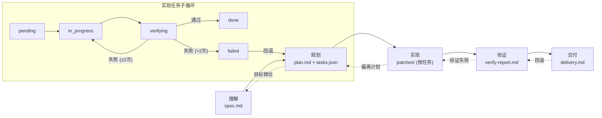
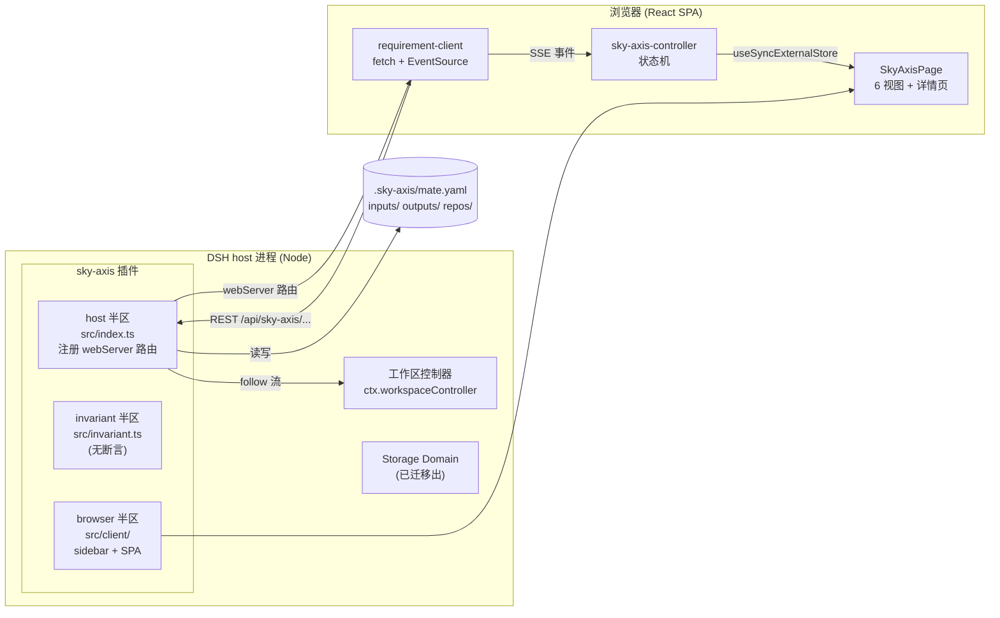

# @leizhuang/sky-axis

English | [English](README.md)

一个纯浏览器的 DSH Web GUI 插件：在主列渲染「开发工作台」sky-axis SPA，
包括一个可折叠 icon rail 的 sidebar、个人二级目录（个人 → 需求列表）、
5 个顶层视图（首页 / 团队 / 个人 / 需求列表 / 报表 / 设置），以及基于
host 半区的需求 CRUD + SSE 同步。挂在 sidebar 主树 entry 席位（与 Chat
/ Skills 等同级），**无需修改 DSH 任何源码**。

---


**AI 工作台 —— 5 阶段流水线 + 任务子循环 + 回退机制**



---

## 项目简介

**sky-axis** 是面向 DSH（DeepSeek Harness）的开发工作台插件，把结构化的
需求管理与 AI 驱动的开发工作流带进你的 IDE——让一条需求不再只是一条聊天
消息，而是一个可追踪、物料齐全、AI 可执行的工作单元。

### 要解决的问题

现有 AI 编程助手都运行在单一、易逝的会话之上。没有结构化的地方来沉淀
「我们要做什么、为什么做」，没有一条从理解到交付的流水线驱动 AI，也缺
乏检测并纠正 AI 跑偏的机制。PRD、设计稿、源码仓库、附件等开发物料散
落在各个工具里，团队缺少一个需求驱动开发的单一事实来源。

### 如何解决

sky-axis 在 DSH 内挂载一个整页的**「开发工作台」**——**零源码侵入**。
它引入一条 **5 阶段 AI 流水线**（理解 → 规划 → 实现 → 验证 → 交付），
每个阶段产出类型化产物、拆解为任务，并支持偏差检测与人工介入。需求与
DSH 工作区 1:1 绑定，以 YAML（`.sky-axis/mate.yaml`）持久化，并通过文
件锁保证并发安全。

### 能为用户带来什么

- **结构化需求** —— 按工作区创建、分组、追踪全生命周期，并通过 SSE
  跨标签页实时同步。
- **AI 工作台** —— 5 阶段 Stepper + 任务列表 + 偏差检测 + 回退 / 回滚，
  AI 不再脱缰奔跑。
- **物料中心** —— PRD 文件 / 链接、源码仓库、设计稿、附件、外部链接
  一处归集。
- **人在回路** —— 5 个介入点（任务开始、执行中插话、任务验收、失败
  处理、阶段门禁）让你始终掌控。
- **零集成成本** —— 纯浏览器插件，挂到 DSH sidebar 即可使用，无需
  修改任何 DSH 源码。

### 主要功能点

- Sidebar 主树入口（36px 圆形图标），可折叠为 icon rail，含个人二级
  目录（个人 → 概览 / 需求列表）。
- 6 个顶层视图：首页 / 团队 / 个人 / 需求列表 / 报表 / 设置。
- 需求 CRUD，按工作区分组，SSE 实时同步。
- 需求详情页含「**需求物料**」与「**AI 工作台**」两个 Tab。
- 5 阶段 AI 流水线（理解 → 规划 → 实现 → 验证 → 交付），三列布局：
  AI 协奏 / 阶段工作区 / 介入队列。
- 任务拆解，8 态任务状态机 + 偏差检测。
- 6 类物料区（PRD 文件、PRD 链接、源码仓库、设计稿、附件、外部链接）。
- YAML 作为单一事实来源（SoT），原子文件锁写入。
- 通过官方 `ctx.locale` 服务支持中 / 英双语。

### 架构图

**整体架构 —— 一个 DSH 插件内的三个半区**



---

## 功能

- 在 sidebar 主树添加 `SkyAxis` entry（36px 圆形图标）；点击 entry 切换
  主列 sky-axis 页面的打开 / 关闭。
- 页面内：
  - sidebar（208px / 48px 折叠态）含 5 entry + 「个人」group entry（点击
    展开 / 收起子菜单）+ 底部 QuickActions（新建需求 / 创建分支 / 发起合并请求）
  - viewArea 按 controller.viewKey 渲染：
    - HomeView（MetricCards + ActivityStream + TeamOverview）
    - TeamView（进度 / MR / 成员，mock）
    - PersonalView（个人资料 + 统计，mock）
    - RequirementsView（按 workspace 分组的需求列表，host CRUD + SSE 同步）
    - ReportsView（SVG 图表，mock）
    - SettingsView（主题 / 语言切换，mock）
- 支持中英双语：通过官方 `ctx.locale` 服务注册 `zh` / `en` 字典。
- host 半区：注册 `/api/sky-axis/...` webServer 路由（`ping` / `health` /
  `requirements` CRUD / SSE / `workspaces`）。

## 安装

### 从本地仓库（开发态）

```sh
dsh plugin --profile web add link:/Users/Ray/TraeProjects/sky-axis
```

重启 `dsh web`（或等待热重载），在 sidebar 主树即可看到 `SkyAxis`
entry。

### 从 npm（发布后）

```sh
dsh plugin --profile web add @leizhuang/sky-axis@latest
```

## 构建

```sh
pnpm install
pnpm run build         # tsc -p tsconfig.build.json && tsdown
pnpm run watch         # tsdown --watch
pnpm run typecheck     # tsc --noEmit
pnpm run test          # vitest run
```

构建产物落到 `lib/`：

- `lib/index.js` —— host 入口（注册 webServer 路由）
- `lib/invariant.js` —— invariant 伴生入口（空 apply）
- `lib/client.js` —— 浏览器 bundle，包装在 `window.__ModuleLoader__.load`
  闭包里（loader 模块表要求的格式）
- `lib/types/` —— TypeScript 类型声明

## 架构

```
src/
├── index.ts                         # Host apply：注册 webServer 路由
├── invariant.ts                     # Invariant 伴生入口（无断言）
├── protocol.ts                      # 跨面共享契约（端点 + zod schema）
└── client/
    ├── index.ts                     # Client apply：字典 + sidebar entry + page mount
    ├── locales.ts                   # zh / en 字典（zh 为 key 集真源）
    ├── controller/
    │   └── sky-axis-controller.ts   # 状态机（pageOpen / viewKey / sidebarCollapsed / personalExpanded / requirements）
    ├── mount/
    │   ├── sky-axis-page-mount.tsx  # 主列 React 根挂载
    │   └── sidebar-entry.ts         # sidebar 主树 entry 装配
    ├── api/
    │   └── requirement-client.ts    # fetch /api/sky-axis/... + EventSource
    ├── icons/
    │   └── icons.tsx                # 共享 SVG 图标库
    ├── shared/
    │   └── sidebar-entry-core.ts    # vendored DOM 注入核心
    └── page/
        ├── SkyAxisPage.tsx          # SPA 主体（sidebar + viewArea + modal）
        ├── SkyAxisPage.module.css   # 页面 takeover CSS（data-sky-axis-active）
        ├── sidebar/
        │   ├── SkyAxisSidebar.tsx   # 内部 sidebar（5 entry + 个人 group + QuickActions）
        │   └── sidebar.module.css
        ├── sections/                # MetricCards / ActivityStream / TeamOverview /
        │                            # RequirementsList / NewRequirementModal / QuickActions
        └── views/                   # HomeView / TeamView / PersonalView /
                                     # RequirementsView / ReportsView / SettingsView

shared/
├── tsdown.client.ts                 # 自包含 tsdown 预设（vendored from dsh-web-ui）
└── web-platform.ts                  # PLATFORM_MODULES 冻结模块表

cordis.patch.yml                     # bundle 层 —— 将 ui-sky-axis 行插入 web profile
tsdown.config.ts                     # clientBundle('@leizhuang/sky-axis', [...])
```

### 为什么无需修改源码

DSH 通过声明式 **slot 系统**暴露 sidebar 扩展点。sky-axis 以 id `sky-axis`
注册自己，由共享 `sidebar-entry-core` 把 entry 注入 sidebar 主树，再以
与 task-board / ssh 相同的 `dsh-panel-activate` 协议把页面挂入主列。

## 工作区目录结构

sky-axis 在 DSH workspace 根目录下维护四个顶层目录。所有路径都走沙箱，
插件无法逃逸 workspace。

```
<workspace>/
├── repos/                          # 克隆的源码仓库（Phase 2.6）
│   └── <itemId>/                   # 每个关联仓库一个子目录
├── inputs/                         # 需求物料（Phase 2.5）
│   ├── prd/                        # 上传的 PRD 文件
│   └── attachment/                 # 上传的附件
├── outputs/                        # AI 生成的产物（Sprint 4）
│   ├── plan/                       # 实现方案
│   ├── patch/                      # 代码 patch（unified diff）
│   ├── note/                       # 笔记
│   ├── log/                        # AI 执行日志
│   └── report/                     # 报告
└── .sky-axis/
    └── mate.yaml                   # 工作区元信息（id, title, schema version）
```

要点：
- `repos/` 在 Sprint 1 从 `.sky-axis/repos/` 升到 workspace 根；
  `inputs/` 和 `outputs/` 是 Sprint 3 / Sprint 4 新增。
- `mate.yaml` 在 host 启动期幂等创建；如已存在，host 交叉校验
  `workspace.id` 与实时 workspace 列表，检测到路径 / ID 不一致时抛
  `WorkspaceMetaError`。
- artifact 路由（`/api/sky-axis/artifacts/{kind}/write`）**已注册但默认
  不被使用** —— 当前 AI 事件流仍走 KV-only 路径。未来产品决定开启落盘时，
  在合适的 AI 事件时机调用即可；host 代码无需改动。

## 安全模型

本插件 host 侧只通过官方 DSH `apiProxy` + `webServer` + `storageDomain`
服务操作；只注册 `/api/sky-axis/...` 命名空间路由，且只读写自己的 storage
domain `sky_axis_requirements`。所有 UI 在浏览器侧渲染。

## 许可

MIT
